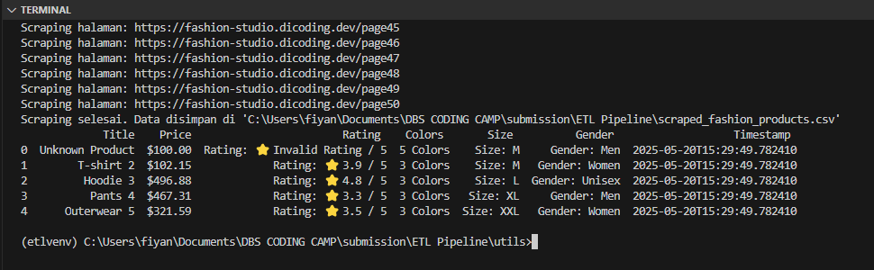

# 📊 ETL Pipeline: Fashion Product Scraper

Proyek ini adalah implementasi pipeline **ETL (Extract, Transform, Load)** sederhana menggunakan Python. Pipeline ini dirancang untuk mengambil data produk fashion dari sebuah situs web yaitu https://fashion-studio.dicoding.dev/, melakukan pembersihan dan transformasi data, dan akhirnya menyimpannya ke dalam berbagai format seperti CSV, Google Sheets, database PostgreSql.

## 🧩 Struktur Proyek

## 🔁 Alur ETL

### 1. Extract
- **Modul:** `extract.py`
- **Deskripsi:** Mengambil data produk fashion dari halaman-halaman web menggunakan `requests` dan `BeautifulSoup`.
- **Output:** Data mentah disimpan dalam `scraped_fashion_products.csv`.

### 2. Transform
- **Modul:** `transform.py`
- **Deskripsi:** Membersihkan nilai-nilai kosong, mengonversi format harga, rating, dan atribut lainnya agar seragam.
- **Output:** Data bersih disimpan dalam `cleaned_fashion_products.csv`.

### 3. Load
- **Modul:** `load.py`
- **Deskripsi:** Memuat data hasil transformasi ke dalam:
  - File CSV (lokal)
  - Google Sheets (menggunakan Google Sheets API v4)
  - Tabel pada Database postgress

## 🧪 Testing

Setiap modul ETL memiliki file test tersendiri menggunakan `unittest`, yang berada dalam folder `tests/`.

Untuk menjalankan seluruh unit test, gunakan perintah berikut dari direktori root proyek:

> pytest tests/

Jika ingin menjalankan test tertentu (misal):
> pytest tests/test_extract.py

Cara Menjalankan Test Coverage
----------------------------------
Untuk menghitung dan menampilkan coverage dari folder `utils`, jalankan:

> pytest --cov=utils --cov-report=term-missing tests/

Hasilnya akan menampilkan presentase cakupan kode (coverage) dan baris mana saja yang belum diuji.

## Outputs

1. output `extract.py`

2. output `transform.py`

3. output `load.py`

